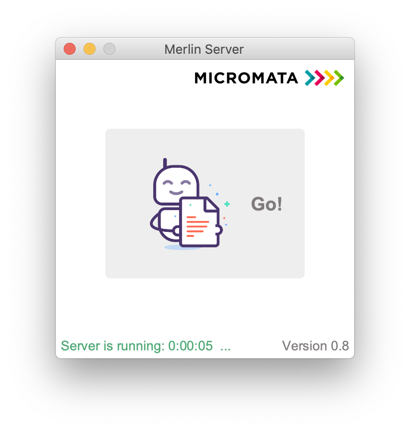
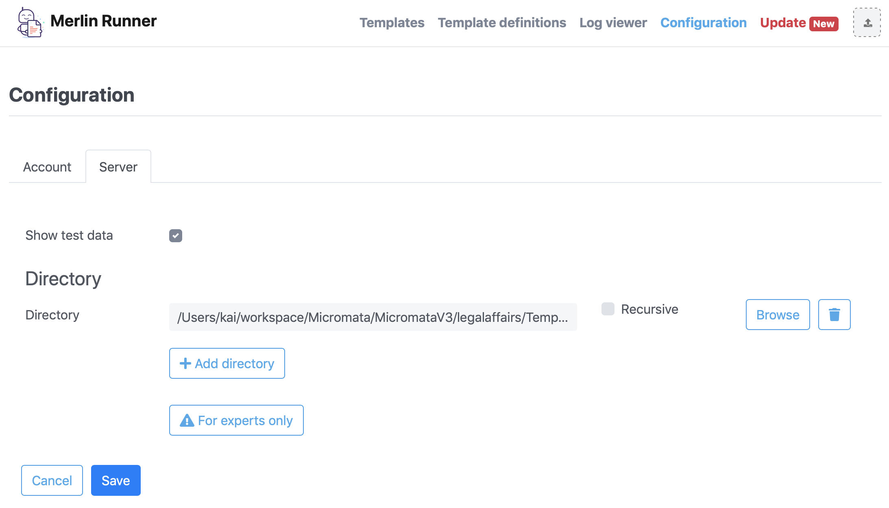

Merlin Installation
===================
Micromata GmbH, Kai Reinhard, Version {version}
:toc:
:toclevels: 4

:last-update-label: Copyright (C) 2018, Last updated

link:index.html[Top]

== Welcome to Merlin Runner application

Congratulations. With Merlin Runner you have started a smart assistant for your daily work with Word documents.

*_Enjoy your work!_*

:sectnums:

== Installation
[%autowidth, frame="topbot",options="header"]
|=======
|Installation file | Platform | Desktop application | Auto-updates | Bundled JRE|Server | Documentation | Examples
|`merlin-macos-<version>.dmg`|MacOS X|yes|yes|yes|yes|yes|yes
|`merlin-windows-<version>.exe`|Windows 64|yes|yes|yes|yes|yes|yes
|`merlin-linux-<version>.sh`|Linux|yes|yes|no|yes|yes|yes
|`merlin-server-<version>.zip`|All|no|no|no|yes|yes|yes
|=======

Description
[%autowidth, frame="topbot"]
|=======
|Platform|Target platform, all contains a Windows start script (.bat) and a generic Unix start script (.sh).
|Desktop application|The desktop application is a platform specific application with a start button. The JavaFX modules are included.
|Auto-updates|On every start-up Merlin will look for any available updates. If updates are available a updating process can be started with a single click.
|Bundled JRE|For versions with a bundled JRE no Java version is required. The *bundled Java Runtime Environment doesn't affect* any installed Java version.
|Server|Contains all the Merlin functionality. Any configuration of the Merlin server can be done via a web browser. There is also a convenient log file viewer available in the web browser.
|Documentation|Contains this documentation
|Examples|Example templates and template definitions for getting in touch with Merlin.
|=======

=== Download
You may download the latest installation files ready to run: +
[.text-center]
https://sourceforge.net/projects/merlinrunner/[Merlin on SourceForge^] +
[.text-left]
The installer is available for MacOS X, Windows and Linux.
For all platforms there is also a pure Server version available (including generic start scripts).

=== Bundled Java
The Java Runtime Environment is bundled for the MacOS X and Windows version. The *bundled Java will not affect* any
previous installed Java version, it's only installed locally inside the applications installation dir.

== Starting the Desktop application
After installation you may start Merlin:

.The Merlin server (as Desktop application).
[caption="Figure 1: "]

By clicking on the button of the desktop application a web browser will be opened. You can do everything through this
web server (working with templates as well as administration stuff such as looking in log files or configuration of the server).

== Configuration

.The Merlin configuration screens.
[caption="Figure 2: "]
image::images/Merlin-ConfigurationScreen1.png[Merlin_ConfigurationScreen1]

.The Merlin configuration screens.
[caption="Figure 3: "]

== Log viewer

.The Merlin log viewer.
[caption="Figure 4: "]
image::images/Merlin-LogViewer.png[Merlin_LogViewer]
